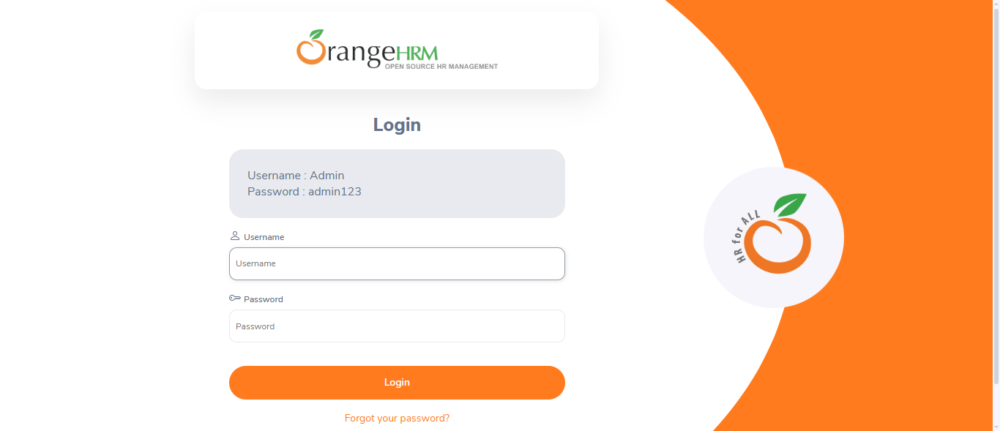
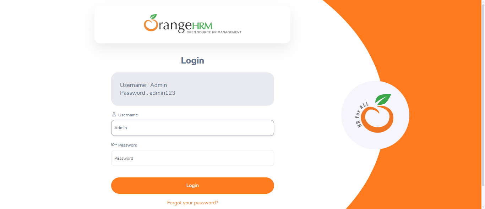
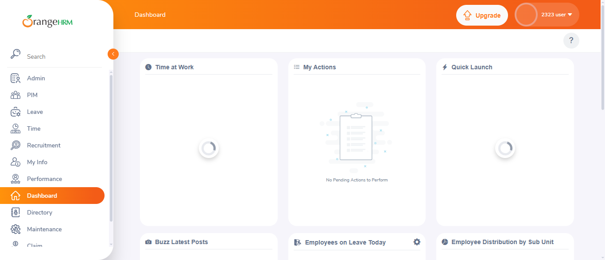

# 🚀 Automated Regression Testing Project

## 📌 Project Overview
This project demonstrates Automated Regression Testing on a web application using Selenium WebDriver with Python.  
The main focus is to automate login functionality and verify UI components such as Dashboard and Side Menu.

---

## 🌐 Website Used
:contentReference[oaicite:0]{index=0}  
https://opensource-demo.orangehrmlive.com

---

## ⚙️ Tech Stack
- Python 🐍  
- Selenium WebDriver 🌐  
- ChromeDriver  
- VS Code  

---

## 🎯 Test Scenarios
✔ Login Functionality Test  
✔ Dashboard Verification Test  
✔ Side Menu UI Verification Test  

---

## 💻 Automation Flow

### Step 1: Open Login Page

---

### Step 2: Enter Username

---

### Step 3: Enter Password

---

### Step 4: Dashboard Loaded

---

## 🧪 Test Result
✔ Login Successful  
✔ Dashboard Loaded Correctly  
✔ Side Menu Verified  

---

## 📊 Conclusion
Automated regression testing was successfully performed on the application.  
All test cases passed successfully, confirming that the login functionality and UI components are working correctly.

Automation testing helps in:
- Reducing manual effort  
- Increasing testing speed  
- Improving accuracy  
- Supporting regression testing  

---

---

## 🎥 Demo Video
(Add your screen recording link here) Soon

---

## 🏷️ Tags
#Selenium #Python #AutomationTesting #QA #RegressionTesting #SoftwareTesting
